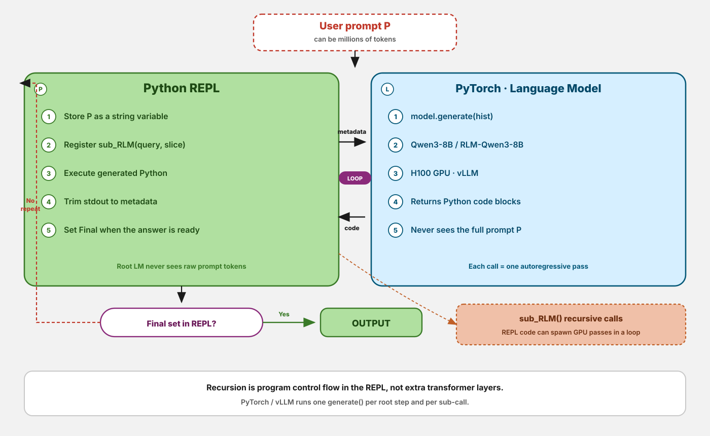
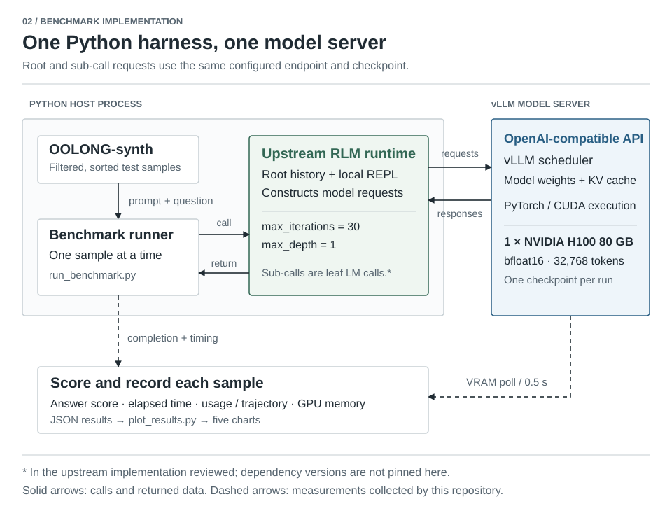

# Recursive Language Models

**PyTorch Conference EU 2026 · Paris**

Rudraksh Karpe (Simplismart) · Shivay Lamba (Qualcomm)

An RLM keeps a long input in a Python environment and uses a language model to write programs over it. Those programs can inspect text, delegate subproblems to model calls, and combine their results. This repository accompanies our conference poster and explores the serving cost of that approach with Qwen3-8B, vLLM, and a single H100.

[Poster PDF](poster/PyTorch%20Conference_2026_Paris.pdf) · [Poster HTML source](poster/pytorch-rlm-poster.html) · [Research paper](https://arxiv.org/abs/2512.24601v2) · [Benchmark guide](benchmark/README.md)

## How an RLM works

The key distinction is **where the long input lives**. The root model receives a description of the input and a way to access it; the full input is held in REPL state. Generated Python selects what to inspect or pass into further model calls. This is the inference scaffold described by [Zhang, Kraska, and Khattab, §2 and Algorithm 1](https://arxiv.org/html/2512.24601v2#S2).



*Figure 1. Conceptual RLM algorithm, redrawn from the paper. Sub-calls may recursively run the same scaffold; the benchmark below uses a shallower configuration.*

Three details matter when reading the diagram:

- **State persists between reasoning steps.** Input text and intermediate values remain available to the generated program.
- **Model calls still have context limits.** Metadata and feedback can be bounded per step while the root history grows. Selected excerpts can enter that history or a sub-call.
- **Recursion is in the program.** It does not add transformer layers or extend the model's native context window.

## How this repository runs it

The repository supplies the dataset loader, experiment presets, measurements, charts, and conference materials. The RLM runtime and model checkpoints come from upstream projects.



*Figure 2. Execution and measurement boundaries derived from the [runner](benchmark/run_benchmark.py), [server launcher](benchmark/serve_model.sh), and [collector](benchmark/metrics/collector.py). Boxes inside the Python boundary are software components, not independent services. The server box groups its API, execution stack, and GPU allocation.*

The runner calls `rlm.completion(sample.prompt, root_prompt=sample.question)` with a local REPL, at most 30 root iterations, and `max_depth=1`. In the [upstream revision reviewed](https://github.com/alexzhang13/rlm/blob/d04208afbad29ca675ab13478c40ee8bebc84bfe/rlm/core/rlm.py), that depth makes sub-calls plain LM completions rather than nested REPL loops. Root and sub-calls use the same configured model endpoint. The model's 32,768-token serving limit and the loader's 131,072-token input filter apply at different boundaries.

[Architecture sources and implementation notes](docs/architecture.md) document the evidence behind both figures and how to regenerate them.

## What the benchmark compares

The intended study is a two-checkpoint, three-preset comparison. Both checkpoints run through the RLM scaffold:

| Checkpoint | Role |
| --- | --- |
| [`Qwen/Qwen3-8B`](https://huggingface.co/Qwen/Qwen3-8B) | Base weights |
| [`mit-oasys/rlm-qwen3-8b-v0.1`](https://huggingface.co/mit-oasys/rlm-qwen3-8b-v0.1) | Upstream weights fine-tuned for RLM use |

| Runner preset | Intended server prefix caching | `max_concurrent_subcalls` passed to RLM |
| --- | --- | ---: |
| `baseline` | Disabled | 1 |
| `prefix-cache` | Enabled | 1 |
| `prefix-cache-batched` | Enabled | 4 |

**These are requested settings, not verified execution states.** The runner does not configure or inspect the server's cache. The launcher only supplies an enable flag, so omitting it does not establish a cache-off baseline across vLLM versions. At `max_depth=1`, the reviewed upstream runtime also bypasses the recursive thread pool controlled by `max_concurrent_subcalls`; changing 1 to 4 does not establish a sequential-versus-parallel comparison. See the [benchmark limitations](benchmark/README.md#before-interpreting-results).

The two performance hypotheses are distinct:

- **Prefix reuse:** vLLM can reuse cached KV blocks for matching prompt prefixes, saving prefill work. It does not save token decoding work, and different context slices need not share reusable prefixes. See [vLLM automatic prefix caching](https://docs.vllm.ai/en/latest/features/automatic_prefix_caching/).
- **Independent sub-calls:** overlapping independent requests could reduce elapsed time if the generated program exposes that parallelism and the runtime and server execute it. A higher concurrency setting alone is insufficient evidence.

Samples are selected from the OOLONG-synth test split, filtered by context length, sorted by `context_window_id`, and capped at 20 by default. This is a small serving experiment; it does not reproduce the paper's full evaluation protocol.

## Measurements and results

| Recorded field | Meaning and measurement boundary |
| --- | --- |
| Task score | Local OOLONG answer scorer in `[0, 1]`; numerical answers can receive partial credit |
| Wall-clock time | Timed completion call plus metric extraction; excludes dataset loading, server startup, and answer scoring |
| Peak VRAM | Maximum device-wide memory observed at 0.5-second intervals; includes server allocations and can miss shorter peaks |
| Input / output tokens | Usage summary reported by the RLM runtime |
| Iterations / sub-calls | Counts extracted from trajectory metadata, when that schema is available |

The runner writes per-sample records, errors, and aggregates. Aggregates include only samples without recorded errors. Missing trajectory metadata currently produces zero counts, so inspect logs before treating zero as an observed absence of work.

**No H100 result JSON files are committed in this checkout.** The poster includes published research results; this README makes no measured speedup claim for the serving presets. For the paper's cross-task evaluation and fine-tuning results, use [Table 1 and Appendix A](https://arxiv.org/html/2512.24601v2), rather than comparing its scores directly with this harness's default 20-sample slice.

## Run the benchmark

Use a CUDA GPU host with Python 3.11+, NVIDIA drivers, `git`, `curl`, and `lsof`. The target configuration is one H100 80GB. Read the [version and configuration checks](benchmark/README.md#before-interpreting-results) before running comparisons.

```bash
git clone https://github.com/rudrakshkarpe/PyTorch-Conference-EU-2026.git
cd PyTorch-Conference-EU-2026/benchmark
bash setup_h100.sh
source .venv/bin/activate

# Smoke run with caching explicitly requested; this is not an ablation result.
bash serve_model.sh --model Qwen/Qwen3-8B --prefix-caching
python run_benchmark.py --model Qwen/Qwen3-8B --config prefix-cache --samples 1
```

The setup script installs dependencies and downloads both checkpoints. The launcher replaces any process listening on its selected port. Results and RLM logs go to `benchmark/results/`; `python plot_results.py` produces the five charts once result files exist.

The [benchmark guide](benchmark/README.md) contains the full command sequence, CLI defaults, output files, and interpretation limits.

## Repository guide

| Path | Contents |
| --- | --- |
| [`benchmark/`](benchmark/) | Runner, vLLM launcher, setup, dataset loading, scoring, and chart generation |
| [`docs/architecture.md`](docs/architecture.md) | Figure sources, claim-to-code mapping, and rendering instructions |
| [`docs/generate_architecture.py`](docs/generate_architecture.py) | Editable source for both SVG figures and PNG exports |
| [`poster/`](poster/) | Conference PDF, standalone HTML poster, and assets |

## Credits and citation

Conference materials and benchmark harness: [Rudraksh Karpe](https://github.com/rudrakshkarpe) and [Shivay Lamba](https://github.com/shivaylamba).

The RLM method, [runtime](https://github.com/alexzhang13/rlm), and fine-tuned checkpoint are upstream work by Alex L. Zhang, Tim Kraska, Omar Khattab, and MIT OASYS. The benchmark uses [OOLONG-synth](https://huggingface.co/datasets/oolongbench/oolong-synth), with local scoring adapted from [OOLONG's evaluation helpers](https://github.com/abertsch72/oolong), and [vLLM](https://github.com/vllm-project/vllm) for serving.

```bibtex
@misc{zhang2026recursivelanguagemodels,
  title={Recursive Language Models},
  author={Alex L. Zhang and Tim Kraska and Omar Khattab},
  year={2026},
  eprint={2512.24601},
  archivePrefix={arXiv},
  primaryClass={cs.AI},
  url={https://arxiv.org/abs/2512.24601},
}
```
