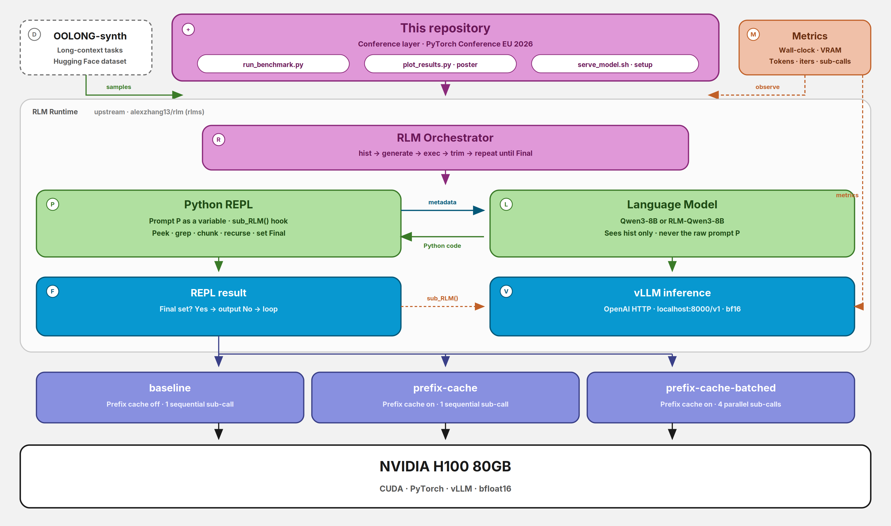
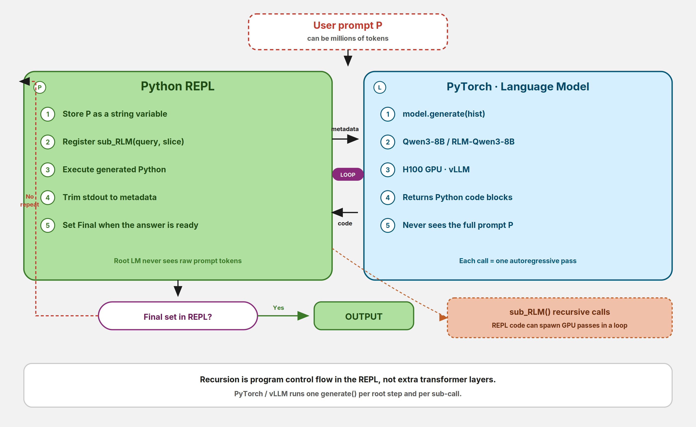

# Recursive Language Models

**PyTorch Conference EU 2026 · Paris**

Conference artifact for the poster and talk *Recursive Language Models (RLMs): Scaling to Infinite Context via Programmatic Decomposition*, including the H100 inference study *Accelerating RLM Inference with vLLM Optimizations*.

**Rudraksh Karpe** ([@rudrakshkarpe](https://github.com/rudrakshkarpe)) · Simplismart  
**Shivay Lamba** ([@shivaylamba](https://github.com/shivaylamba)) · Qualcomm

[Poster (PDF)](./poster/PyTorch%20Conference_2026_Paris.pdf) · [Interactive poster](./poster/pytorch-rlm-poster.html) · [Paper](https://arxiv.org/abs/2512.24601) · [Upstream RLM library](https://github.com/alexzhang13/rlm)

---

## What this repository is

Recursive Language Models are an inference paradigm from MIT OASYS ([Zhang, Kraska, Khattab](https://arxiv.org/abs/2512.24601)). An RLM is a thin wrapper around any language model: the prompt lives as data in a Python REPL, and the model writes code to peek, chunk, search, and recursively call itself on smaller slices. The root model never sees the raw long context — only constant-size metadata.

This repository does **not** reimplement that engine. It is the conference layer on top of it:

1. A concise architecture write-up of how RLMs sit on PyTorch / vLLM.
2. An H100 benchmark harness that compares base **Qwen3-8B** against **RLM-Qwen3-8B** under three vLLM serving configurations.
3. The poster (PDF + HTML) used at PyTorch Conference EU 2026.

| Layer | What it is | Source |
| --- | --- | --- |
| RLM inference paradigm | Prompt-as-REPL-data + recursive `sub_RLM()` | [Zhang et al., 2026](https://arxiv.org/abs/2512.24601) |
| Runtime | `rlm.completion()` over a local / IPython REPL | [`alexzhang13/rlm`](https://github.com/alexzhang13/rlm) (`rlms`) |
| Fine-tuned weights | SFT on 1K distilled RLM trajectories | [`mit-oasys/rlm-qwen3-8b-v0.1`](https://huggingface.co/mit-oasys/rlm-qwen3-8b-v0.1) |
| Long-context tasks | OOLONG-synth | [`oolongbench/oolong-synth`](https://huggingface.co/datasets/oolongbench/oolong-synth) |
| Serving engine | OpenAI-compatible local inference | [vLLM](https://github.com/vllm-project/vllm) |
| **This repo** | H100 ablation, metrics, charts, poster | Sections below |

---

## Architecture

Same visual language as [KAITO](https://github.com/kaito-project/kaito): a control-plane box on top, a runtime pool in the middle, serving configs below, hardware at the bottom. Pink is this repository and the orchestrator. Green is the RLM surfaces. Blue is inference. Purple is the serving ablation. Dashed orange is metrics.



Prefix caching is a vLLM feature. Concurrent sub-calls are an RLM runtime knob (`max_concurrent_subcalls`). What we add is the **ablation that isolates each**, plus the measurement harness around it.

### Upstream RLM loop

The control flow is programmatic, not extra transformer layers. PyTorch (via vLLM) runs one autoregressive `generate()` per root step and per sub-call.



**Three design choices that matter**

1. **Prompt as environment data.** `P` lives outside the transformer as a REPL variable.
2. **Constant-size root context.** The root LM sees length, a prefix, and stdout summaries — not the raw tokens.
3. **Symbolic recursion.** The model writes Python that peeks, greps, chunks, and calls `sub_RLM()` inside loops. Recursion is program control flow, not extra layers.

---

## What we contributed

On top of the published RLM system we built a reproducible inference study and the conference materials.

**1. Three-config serving ablation on a single H100**

Same seeds, same OOLONG-synth samples, same RLM hyperparameters. Only the serving path changes.

| Config | Prefix caching | Concurrent sub-calls | What it measures |
| --- | :---: | :---: | --- |
| `baseline` | off | 1 (sequential) | vLLM defaults |
| `prefix-cache` | on | 1 (sequential) | reused REPL / prompt prefixes |
| `prefix-cache-batched` | on | 4 (parallel) | prefix cache + parallel `sub_RLM()` |

RLM queries are prefix-heavy: the root prompt and shared context slices repeat across iterations and sub-calls. Automatic prefix caching should cut prefill. Batching sub-calls should cut wall-clock when the model partitions context and maps `sub_RLM()` over chunks.

**2. End-to-end benchmark harness**

- `serve_model.sh` — bring up / tear down a vLLM server, wait on `/health`.
- `run_benchmark.py` — drive `RLM(backend="vllm")` over OOLONG-synth.
- `metrics/collector.py` — background VRAM poll (`pynvml` or `nvidia-smi`), wall-clock timer, trajectory extraction (REPL iterations, sub-call count, token usage).
- `tasks/oolong_loader.py` — Hugging Face load + scoring that mirrors the official OOLONG helpers.

**3. Poster-ready reporting**

`plot_results.py` writes five charts from the JSON dumps: wall-clock, peak VRAM, accuracy, speedup vs baseline, iterations / sub-calls.

**4. Conference poster**

Print PDF and a standalone HTML version of the architecture, related-work comparison, and paper results.

We did not train RLM-Qwen3-8B, and we did not change the RLM algorithm. The model is the MIT OASYS SFT checkpoint (1K trajectories distilled from Qwen3-Coder-480B, about 48 H100-hours). Our work is how that system is served, measured, and presented.

---

## Benchmark design

### Models

| Model | Role |
| --- | --- |
| [`Qwen/Qwen3-8B`](https://huggingface.co/Qwen/Qwen3-8B) | Base checkpoint, no RLM fine-tuning |
| [`mit-oasys/rlm-qwen3-8b-v0.1`](https://huggingface.co/mit-oasys/rlm-qwen3-8b-v0.1) | RLM-SFT checkpoint |

Both run through the same RLM scaffold. The fine-tuned weights are what the paper reports as a **+28.3% median** gain over the base model on the paper's task suite.

### Metrics (per sample)

| Metric | How it is collected |
| --- | --- |
| Task score | OOLONG-synth accuracy in `[0, 1]` |
| Wall-clock | End-to-end seconds around `rlm.completion()` |
| Peak VRAM | Max GPU memory (MiB), 0.5s poll |
| Tokens | Input + output from the RLM usage summary |
| REPL iterations | Length of the logged trajectory |
| Sub-call count | `rlm_calls` inside executed code blocks |

### Paper results we present (not from this harness)

These numbers are from Zhang et al. They are on the poster so the talk has the research context. The H100 suite above is our reproduction / serving study on Qwen3-8B.

**GPT-5 family (paper; RLM sub-calls to GPT-5-mini)**

| Method | CodeQA | Browse+ | OOLONG | O-Pairs |
| --- | ---: | ---: | ---: | ---: |
| Base GPT-5 | 24* | 0* | 44 | &lt;0.1 |
| CodeAct + BM25 | 22* | 51 | 38 | 24.7 |
| Summary agent | 58 | 70.5 | 46 | &lt;0.1 |
| **RLM** | **62** | **91.3** | **56.5** | **58.0** |

**Qwen3-8B (paper; the open model this repo serves)**

| Setting | CodeQA | Browse+ | OOLONG | O-Pairs |
| --- | ---: | ---: | ---: | ---: |
| Base | 4* | 0* | 0* | 0.1 |
| RLM scaffold | 26 | 2 | 24 | 4.3 |
| **RLM-Qwen3-8B** | **32** | **14** | **32** | **5.2** |

`*` hit context limits on some runs.

---

## Reproduce the H100 study

Hardware: one NVIDIA H100 80GB (or similar). Software: Python 3.11+, CUDA drivers, `git`, `curl`, `lsof`.

```bash
cd benchmark
bash setup_h100.sh
source .venv/bin/activate
```

`setup_h100.sh` creates the venv, installs [`requirements.txt`](./benchmark/requirements.txt), and pre-downloads both checkpoints.

```bash
# Base model
bash serve_model.sh --model Qwen/Qwen3-8B
python run_benchmark.py --model Qwen/Qwen3-8B --config baseline --samples 20
# restart with caching for the two optimized configs
bash serve_model.sh --model Qwen/Qwen3-8B --prefix-caching
python run_benchmark.py --model Qwen/Qwen3-8B --config prefix-cache --samples 20
python run_benchmark.py --model Qwen/Qwen3-8B --config prefix-cache-batched --samples 20

# Fine-tuned RLM weights
bash serve_model.sh --model mit-oasys/rlm-qwen3-8b-v0.1
python run_benchmark.py --model mit-oasys/rlm-qwen3-8b-v0.1 --config baseline --samples 20
bash serve_model.sh --model mit-oasys/rlm-qwen3-8b-v0.1 --prefix-caching
python run_benchmark.py --model mit-oasys/rlm-qwen3-8b-v0.1 --config prefix-cache --samples 20
python run_benchmark.py --model mit-oasys/rlm-qwen3-8b-v0.1 --config prefix-cache-batched --samples 20

python plot_results.py
```

JSON and PNGs land in `benchmark/results/`.

Prefix caching is a **server** flag (`--enable-prefix-caching`). Concurrent sub-calls are a **client** flag (`--config prefix-cache-batched` sets `max_concurrent_subcalls=4`). Restart vLLM when you change the cache setting; you do not need a restart to change the RLM config.

### CLI

`run_benchmark.py`

| Flag | Default | |
| --- | --- | --- |
| `--model` | required | Hugging Face model id |
| `--config` | required | `baseline` · `prefix-cache` · `prefix-cache-batched` |
| `--samples` | `20` | OOLONG-synth cap |
| `--vllm-url` | `http://localhost:8000/v1` | |
| `--gpu-device` | `0` | VRAM poll device |
| `--task-filter` | unset | substring match on the dataset name |
| `--max-context-len` | `131072` | |
| `--output-dir` | `results/` | |

`serve_model.sh`

| Flag | Default | |
| --- | --- | --- |
| `--model` | required | |
| `--port` | `8000` | |
| `--prefix-caching` | off | passes `--enable-prefix-caching` |
| `--gpu-mem` | `0.90` | |
| `--dtype` | `bfloat16` | |

---

## Repository layout

```text
.
├── README.md
├── docs/
│   ├── architecture.png         # system diagram (KAITO-style)
│   ├── architecture-loop.png    # RLM inference loop
│   └── generate_architecture.py
├── benchmark/
│   ├── run_benchmark.py     # 2×3 ablation runner
│   ├── plot_results.py      # wall-clock, VRAM, accuracy, speedup, iterations
│   ├── serve_model.sh       # vLLM serve + /health wait
│   ├── setup_h100.sh        # venv, deps, weight download
│   ├── requirements.txt
│   ├── metrics/collector.py # VRAM thread, timer, RLM metadata
│   ├── tasks/oolong_loader.py
│   └── results/             # JSON dumps + PNG charts
└── poster/
    ├── PyTorch Conference_2026_Paris.pdf
    ├── pytorch-rlm-poster.html
    ├── pytorch-logo.png
    └── qr-code.png
```

---

## Acknowledgments

RLMs, the `rlms` library, and the RLM-Qwen3-8B checkpoint are the work of **Alex L. Zhang, Tim Kraska, and Omar Khattab** and the MIT OASYS lab. OOLONG scoring follows the official helpers from [`abertsch72/oolong`](https://github.com/abertsch72/oolong). vLLM automatic prefix caching is from the vLLM project.

```bibtex
@misc{zhang2026recursivelanguagemodels,
  title={Recursive Language Models},
  author={Alex L. Zhang and Tim Kraska and Omar Khattab},
  year={2026},
  eprint={2512.24601},
  archivePrefix={arXiv},
  primaryClass={cs.AI},
  url={https://arxiv.org/abs/2512.24601},
}
```
